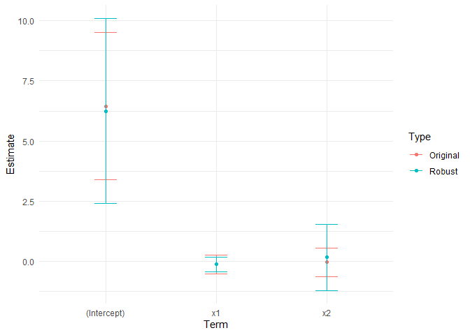

<!-- README.md is generated from README.Rmd. Please edit that file -->

# gifistab

<!-- badges: start -->
<!-- badges: end -->

The gifistab R package aims to provide a robust framework for the
stability assessment of statistical models. This framework, based on the
broad definitions of seven types of stability as presented in
[Michailides and de Leeuw
(1998)](https://escholarship.org/uc/item/0789f7d3), includes:

1)  Replication Stability. Given a newly sampled dataset, the
    application of the same technique should yield results that do not
    change dramatically.

2)  Statistical Stability. This refers to the stability of the analysis
    when no new dataset is formally sampled.

3)  Stability under Data Selection. This involves considering variations
    in data by either omitting objects from the dataset or variables
    from the subsequent analysis. The former corresponds to the
    rejection of outliers and resampling techniques. Resampling
    techniques can be considered a form of replication stability without
    the formal sampling of a new dataset.

4)  Stability under Model Selection. Small changes in the model should
    yield only minor alterations in the results.

5)  Numerical Stability. This refers to the impact of rounding errors
    and computations with limited precision on the results produced by
    the techniques.

6)  Analytic and Algebraic Stability. Given sufficient mathematical
    structure in the data and potential representations, formal
    expressions of the input-output analysis can be derived by
    considering perturbations of the input.

7)  Stability under Selection of Technique. The application of different
    techniques to the same dataset, with the goal of answering the same
    question, should yield approximately the same information.

## Installation

You can install the development version of gifistab from GitHub using
[devtools](https://devtools.r-lib.org/):

``` r
# install.packages("devtools")
devtools::install_github("mightymetrika/gifistab")
```

## Example

The following is a basic example illustrating how to perform a stability
assessment using the stats::lm engine:

``` r
library(gifistab)

stab_res <- suppressWarnings(stability_assessment(data = n20_seed376_lm, # Input data frame
                                                  new_data = n20_seed500_lm, # A new data frame
                                                  nboot = 1000,
                                                  variable_to_remove = "x2",
                                                  variable_of_interest = "x1",
                                                  formula = y ~ x1 + x2,
                                                  engine = stats::lm,
                                                  seed = 184))
```

From the stab_res object, you can further explore the type of stability
assessment you’re interested in by accessing summary tables, plots, and
explanations. For instance, you can explore the ‘Stability under
Selection of Technique’ assessment as follows:

``` r
# View table for the original model
stab_res$gstab_summary$original_summary
#> # A tibble: 3 × 7
#>   term        estimate std.error statistic  p.value conf.low conf.high
#>   <chr>          <dbl>     <dbl>     <dbl>    <dbl>    <dbl>     <dbl>
#> 1 (Intercept)   6.45       1.45      4.46  0.000347    3.39      9.50 
#> 2 x1           -0.120      0.188    -0.639 0.532      -0.516     0.276
#> 3 x2           -0.0342     0.286    -0.120 0.906      -0.638     0.569

# View table for the stability under selection of technique model
stab_res$gstab_summary$technique_stability_summary
#>          term   estimate std.error  statistic     p.value   conf.low  conf.high
#> 1 (Intercept)  6.2456228 1.9586981  3.1886602 0.005377141  2.4066450 10.0846006
#> 2          x1 -0.1246665 0.1504160 -0.8288116 0.418696364 -0.4194765  0.1701434
#> 3          x2  0.1698943 0.6979847  0.2434069 0.810603095 -1.1981305  1.5379191

# View plot
stab_res$gstab_plot$technique_stability_plot
```



``` r

# View explanation
stab_res$gstab_explainer$`Stability under Selection of Technique`
#> $definition
#> [1] "Application of a number of different techniques to the same data set, aiming at answering the same question, results in approximately the same information (Michailides and de Leeuw, 1998)."
#> 
#> $explanation
#> [1] "The stability under selection of technique function in the 'gifistab' package implements this definition by fitting a robust regression model using the same specification as the original model. This helps in assessing the stability of the model under different fitting techniques.\n\n      The function works by first fitting the original model. Then, it fits a robust regression model using the same specification as the original model. The robust regression model is fitted using the 'lmrob' function from the 'robustbase' R package.\n\n      The results of the two models are then compared. If the results are similar, then the model is considered to be stable under different fitting techniques. However, if the results are different, then the model may be unstable under different fitting techniques."
#> 
#> $interpretation
#> [1] "The results of the stability under selection of technique function can be used to assess the robustness of a model to different fitting techniques. If the results of the two models are similar, then the model is considered to be robust. However, if the results of the two models are different, then the model may be unstable under different fitting techniques."
#> 
#> $caution
#> [1] "While the stability under selection of technique function is a valuable tool for assessing the stability of a model, there are a few important considerations to keep in mind:\n\n      Firstly, the function assesses stability by comparing the results of a regular regression model and a robust regression model. While this can provide valuable insights, it's important to remember that these are just two of many possible modeling techniques. The function does not consider other potential techniques, such as non-linear models, ensemble models, or non-parametric methods.\n\n      Secondly, robust regression methods are designed to be less sensitive to outliers and high leverage observations than regular regression. This means that differences between the regular and robust models could be due to these types of observations. Before concluding that a model is unstable under different techniques, it could be helpful to examine the data for outliers and high leverage points.\n\n      Thirdly, the function uses the 'lmrob' and 'glmrob' functions from the 'robustbase' package for fitting the robust models. These functions use specific algorithms and settings for robust regression. Different results might be obtained with other robust regression methods or settings.\n\n      Finally, the function returns NULL if the robust regression model could not be fitted. This could happen for a variety of reasons, including numerical issues or problems with the data. If the function returns NULL, it's important to investigate why the robust model could not be fitted.\n\n      Therefore, while the results from the stability under selection of technique function can provide useful insights into the stability of a model, they should be interpreted as part of a broader analysis of model stability and robustness."
```
